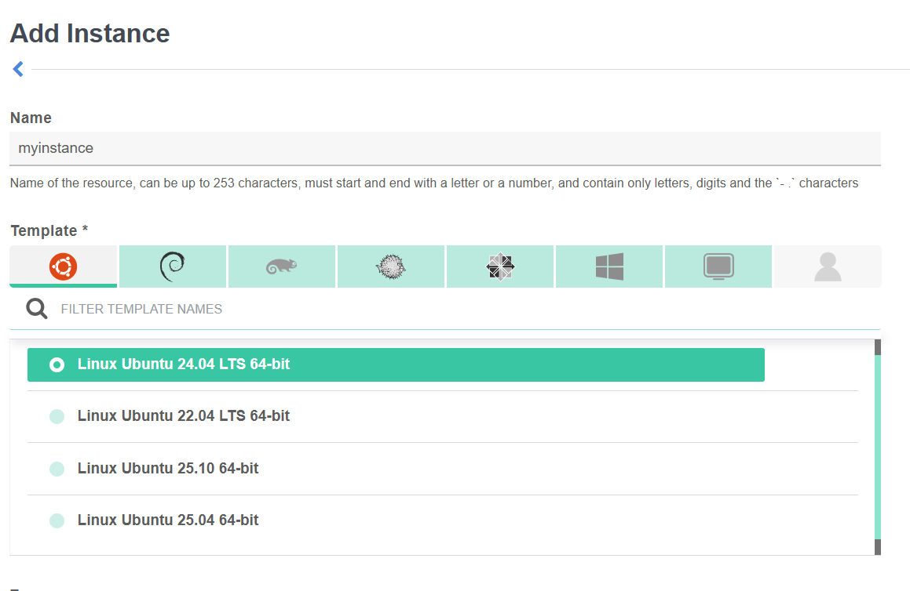
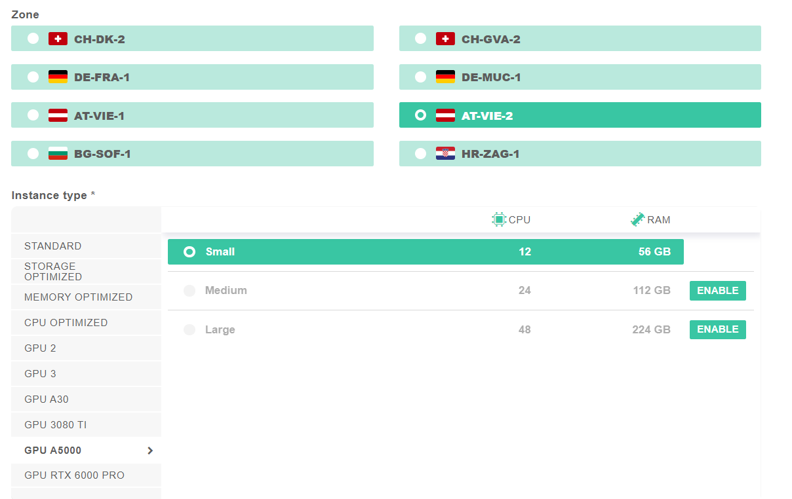
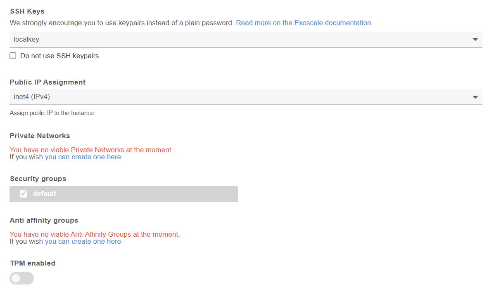

## Replicate the workshop at home
To replicate the workshop at home, or to take next steps, you will need to launch your own compute instance. In the workshop, we will have shared a link to obtain a 50CHF coupon for Exoscale compute resources. On this page, we will guide you through launching a compute instance through Exoscale. However, our set-up should work on any instance with the same operating system.

## Launching a compute instance through Exoscale
When adding an instance, we first have to specify the name and the template. On the instance that you worked in this workshop, we used the template **Linux Ubuntu 24.04 LTS 64-bit**, which is s widely used in production and provides excellent support for Docker, GPUs, and machine learning tooling. 



Next, we have to choose our zone and the required resources. Depending on the model that you want to run, you will have to choose the corresponding required resources. For models in the range of 7B parameters, an A5000 GPU should suffice.



Last, we have to specify the SSH key that we want to use to connect to the compute instance. It is also possible to disable SSH keypairs and use a password authentication, but this is discouraged.



After going through these steps, you will be able to launch your compute instance, and work on it as in the workshop!

{. :note}
> Depending on what you will do on your compute instance, you may need to add rules to your default security group. This can be done through the Compute -> Security Groups tab.


## Installing Nvidia drivers and toolkit
Whereas for a CPU-only instance, installing Docker is sufficient, we now have to install the NVIDIA drivers too.

{: .action}
Follow the steps below to install Docker and the Nvidia drivers and toolkit. For each step, copy the code and paste and execute it on the command line of your compute instance.

* **Step 1:** Install Docker, by retrieving the official installation script. After installation, the Docker service is restarted to ensure it is ready to use.

```bash
# Install docker
curl -fsSL https://get.docker.com | sh
sudo systemctl restart docker
```

* **Step 2:** Install Nvidia drivers and the Nvidia Container Toolkit. The code snippet first adds Nvidia’s official package signing key, which allows Ubuntu to verify that the software it downloads from Nvidia is authentic. It then adds Nvidia’s package repository to your system so that the required drivers and tools can be installed using Ubuntu’s package manager. After updating the package list, the Nvidia GPU driver, supporting utilities, and the Nvidia Container Toolkit are installed. The toolkit is what enables Docker containers to access the GPU securely and efficiently.
  
```bash
# Install Nvidia drivers needed to run the toolkit
curl -fsSL https://nvidia.github.io/libnvidia-container/gpgkey | 
    sudo gpg --dearmor -o /usr/share/keyrings/nvidia-container-toolkit-keyring.gpg && 
    curl -s -L https://nvidia.github.io/libnvidia-container/stable/deb/nvidia-container-toolkit.list |
    sed 's#deb https://#deb [signed-by=/usr/share/keyrings/nvidia-container-toolkit-keyring.gpg] https://#g' |
    sudo tee /etc/apt/sources.list.d/nvidia-container-toolkit.list
sudo apt update
sudo apt install -y nvidia-driver-550-server nvidia-utils-550-server nvidia-container-toolkit
```
* **Step 3:** Reboot the machine. Rebooting is required so the Linux kernel can load the newly installed Nvidia driver. Once the machine restarts, your SSH connection will close; simply reconnect using the same ssh command and password as before.

```bash
sudo reboot
```

_Author: [Alexander Sternfeld](https://ch.linkedin.com/in/alexander-sternfeld-93a01799)_
