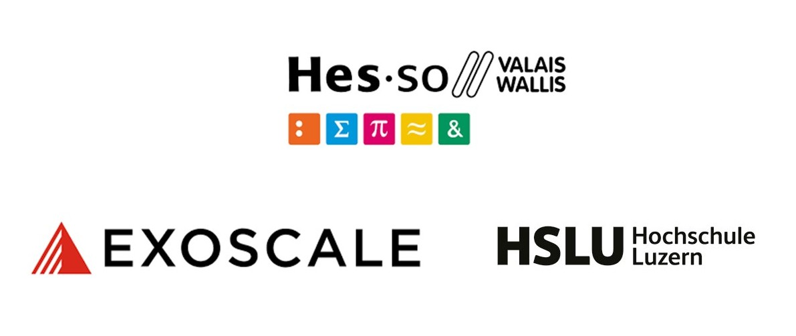

# Welcome! 
Thank you for attending our workshop on LLMs on premise. This website forms the backbone of the workshop, and will provide you with instructions for each of the exercises. We hope you enjoy today and learn plenty!

Alexander Sternfeld and Prof. Dr. Andrei Kucharavy

## Agenda

* 09.00 - 09.30: Introduction
* 09.30 - 10.15: [Serving a LLM on-prem: Open WebUI](technical_installation/server.md)
* 10.15 - 10.45: Break
* 10.45 - 12.00: [Open WebUI functions](functions/quickstart.md)
* 12.00 - 13.00: [How Agents Talk to Tools: Towards MCP](mcp/quickstart.md)
* 13.00 - 14.00: Threat modeling and concluding remarks.

