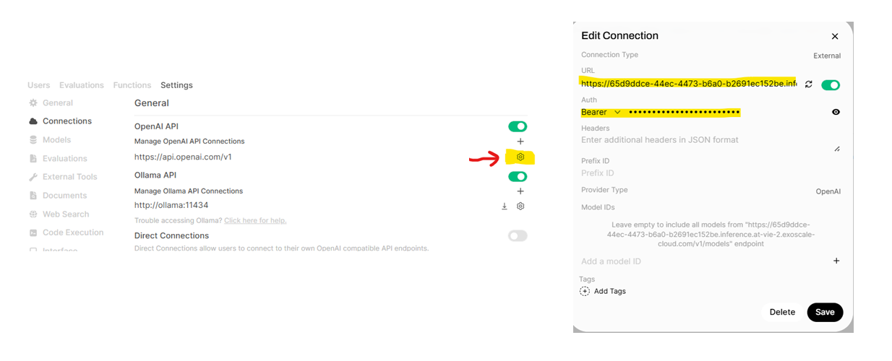

## Adding an Inference Endpoint 
In this part of the workshop, we introduce the concept of **API endpoints** and show how they are used to connect external model providers to Open WebUI. We will also configure one endpoint together, so that you can see how a new model becomes available in the interface.

### Understanding API endpoints
An API (Application Programming Interface) allows different software systems to communicate with each other. An API endpoint is a specific URL that a program can send requests to in order to send a prompt, receive the model's response and manage authentication and permissions. In our case, Open WebUI can connect to multiple LLM providers via API endpoints. Currently, only our local Ollama is configured, in this section we will add an external API endpoint. Each endpoint defines:

* Where the model server is running (the URL)
* How to authenticate (usually via an API key or token)
* Which models become available in the UI

API endpoints are generally configured to serve multiple users simultaneously. The figure below displays what such a set-up looks like. Multiple API clients send their requests to a central load balancer, which distributes the incoming traffic across several API gateways to ensure scalability and high availability. Each API gateway then routes the requests to the appropriate backend API services, handling concerns such as authentication, rate limiting, and request routing. Because of this system, each client only interacts with a unified entry point while the system efficiently balances load and manages access to multiple underlying services.

### Adding an API endpoint in Open WebUI
We will now add a new OpenAI-compatible endpoint to demonstrate how this works. The URL for the API endpoint is XXXXXX. You should see the API key (secret) now on the screen in the workshop, and in the Discord server. The steps below will now guide you through adding the API endpoint to your Open WebUI instance.

{: action}
> 1. Go to the Admin Panel in Open WebUI, and navigate to Settings -> Connections
> 2. Under OpenAI API, click on the Configure button (the wheel icon, see image below)
> 3. Enter:
>      * The provided URL in the endpoint field
>      * The provided API key in te Bearer token field
> 4. Save the configuration

### Verifying the connection
You can now return to the main chat interface, and start a new chat. When opening the model selection dropdown, you should see the Mistral 7B model available in the list. You can select it and start a conversation, to see whether the API endpoint works.

### What's next
Now that you have set up your Open WebUI instance, we can start exploring all different functionalities, take some time to browse around! The next part of the workshop will be [RAG](RAG/exercise.md).

_Author: [Alexander Sternfeld](https://ch.linkedin.com/in/alexander-sternfeld-93a01799)_
